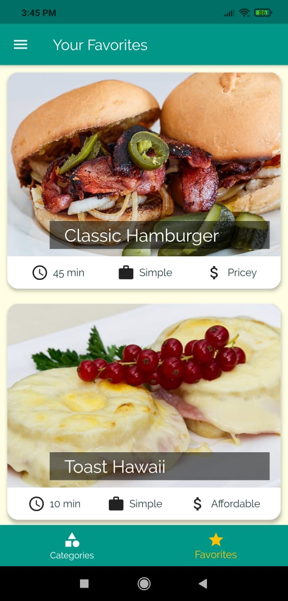
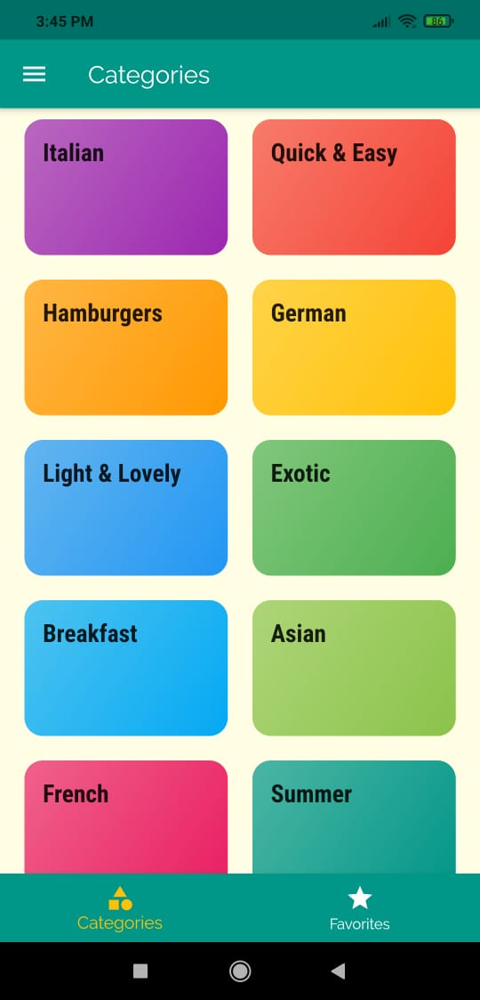
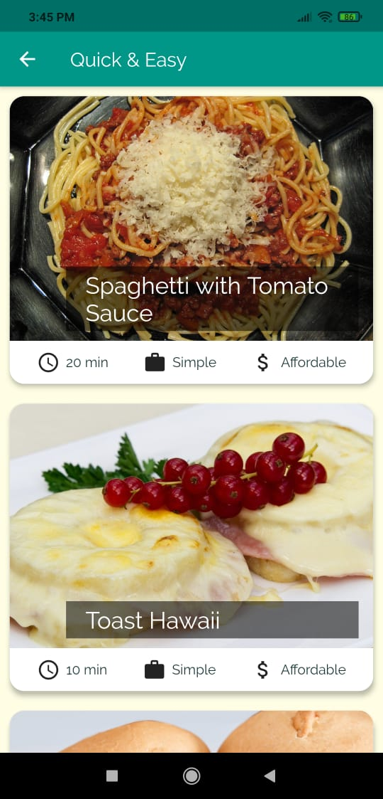
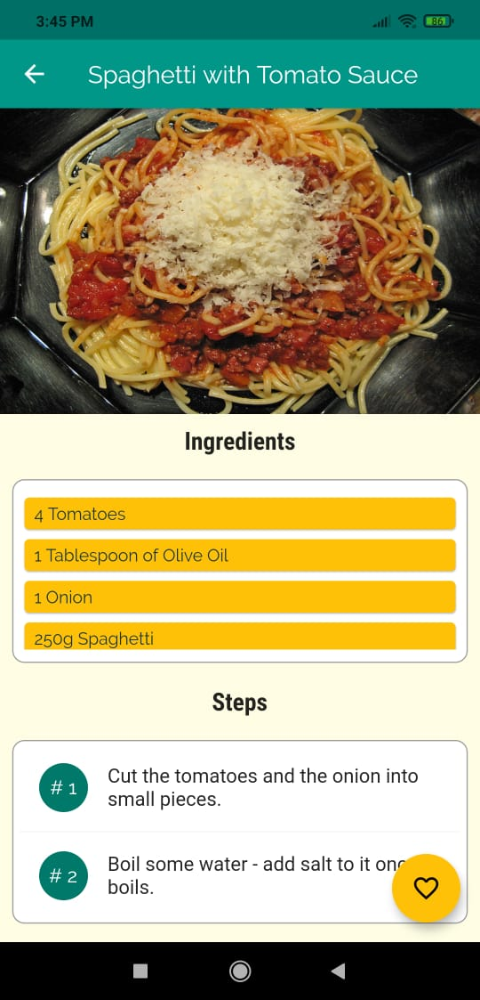
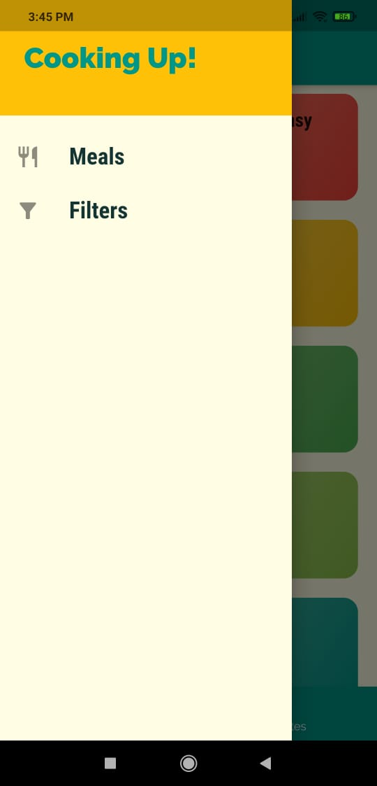
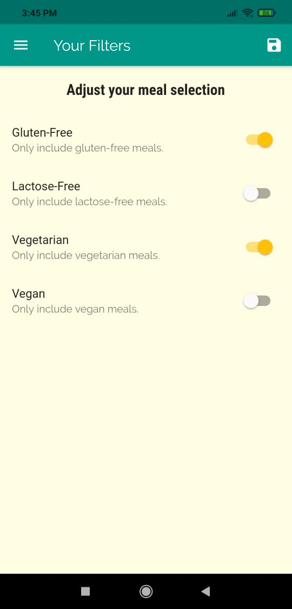

# Meals App

Meals App is a flutter application that allows users to view a variety of food items, view their recipes, mark it as a favorite, and so on.
This is a demo app, so it displays meals with dummy data, but it can easily be linked to dynamic data from a server.

# Features

  - Beautiful and user-friendly UI
  - View recipes for a variety of foods
  - View the steps for preparing your desired meal
  - The favorite button allows you to mark your favorite meals
  - The user can filter meal options based on his or her preferences

# App Screenshots
      
